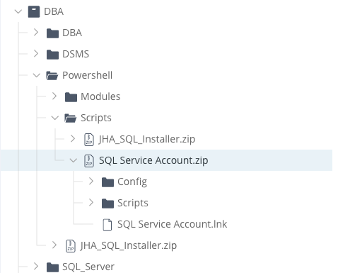
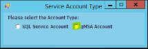
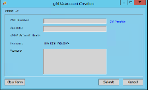
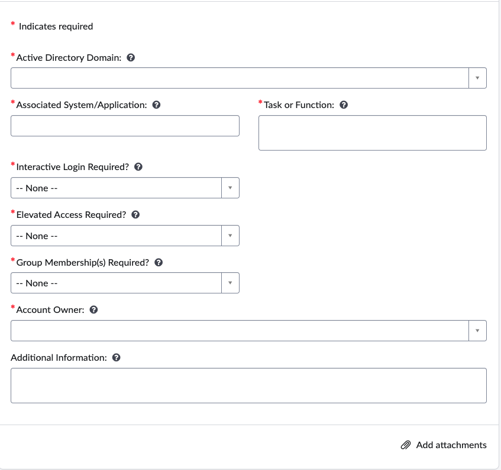

# Service Account Creation
DBops has the ability to create traditional service accounts and Group Managed Service Accounts (gMSA) for the jhahosting.com domain utilizing the "SQL Service Account" tool in artifactory.  Accounts needing to be created in other domains will need a jhNow request sent to ICS-Directory Services.  

**Note:** gMSA accounts are preferred over traditional accounts as they remove the need for dba's to manage a service account username and password.  All password rotations are handled natively within Active Directory.  While they are preferred, some applications may need to pass physical username/password and cannot utilize gMSA.

For more information on gMSA and automatic password rotation, please reference [Microsoft's documentation](https://learn.microsoft.com/en-us/windows-server/identity/ad-ds/manage/group-managed-service-accounts/group-managed-service-accounts/group-managed-service-accounts-overview)

## Provisioning gMSA or traditional Service Account via the SQL Service Account Tool

1. Download the latest "SQL Server Account.zip" from [artifactory](https://jackhenry.jfrog.io/ui/repos/tree/General/DBA/Powershell/Scripts) to a machine in the domain your are creating the account for.

2. Extract the .zip
3. Open the created directory and launch "SQL Service Account"
4. For Traditional Service Accounts, skip to step 5.  For gMSA accounts continue:
- Select the "gMSA" radial button

    

- Input the requested variables in screenshot below:

    

- jhNow or jSource ticket number into the CWI field
- Input the name of the gMSA account to be created (ex: ATXJHENRYDB123) *NOTE:* svc-sql will be added to the prefix automatically
- Domain should autopopulate
- Input all server names (without domain) that the gMSA account should have access to.
- Click submit
5. For Traditional Service Accounts:
- Select the "SQL Service Account" radial button
- Complete the required steps
- Record the username and password in KeePass or Delinea

## Requesting gMSA from Directory Services
1. Open a new [jhNow](https://jhnow.service-now.com/esc) "New Service Account" Request

2. Complete required fields
    - "Task or Function" = New gMSA SQL Server Service Account Request
    - "Associated System/Applicaiton" = List of servers gmsa account should have access to
    - No interactive logon needed
    - No elevated access required
    - "Group Membership Required" = Yes; specific the name of the security group that contains BAK servers for the domain
    - More Information:
        - Set the msDS-SupportedEncryptionTypes attributes of all service accounts associated with this request to 24
        - SELF granted access to modify servicePrincipalName attribute 
        - Delegation enabled for Kerberos

## Requesting traditional service account from Directory Services
1. Open a new [jhNow](https://jhnow.service-now.com/esc) "New Service Account" Request

2. Complete required fields
    - Interactive Login = No
    - Elevated Access Required = No
    - Group Members Required ?
3. Submit
4. Upon completion of the task, record the service account in KeePass or Delinea if avaiable.

*Created on: 11/24/24*

*Last Reviewed on: 2/7/25*