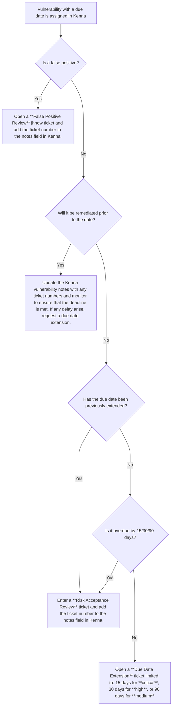

# Vulnerability Management Flowchart - Kenna Tickets 

```mermaid

graph TD
  A[Vulnerability with a due date is assigned in Kenna] --> B{Is a false positive?}
  B -->|Yes| C[Open a **False Positive Review** jhnow ticket and add the ticket number to the notes field in Kenna.]
  B ---->|No| D{Will it be remediated prior to the date?}
  D -->|Yes| E[Update the Kenna vulnerability notes with any ticket numbers and monitor to ensure that the deadline is met. If any delay arise, request a due date extension.]
  D ---->|No| F{Has the due date been previously extended?}
  F -->|Yes| G[Enter a **Risk Acceptance Review** ticket and add the ticket number to the notes field in Kenna.]
  F ---->|No| H{Is it overdue by 15/30/90 days?}
  H -->|Yes| G
  H ---->|No| I[Open a **Due Date Extension** ticket limited to: 15 days for **critical**, 30 days for **high**, or 90 days for **medium**]
```