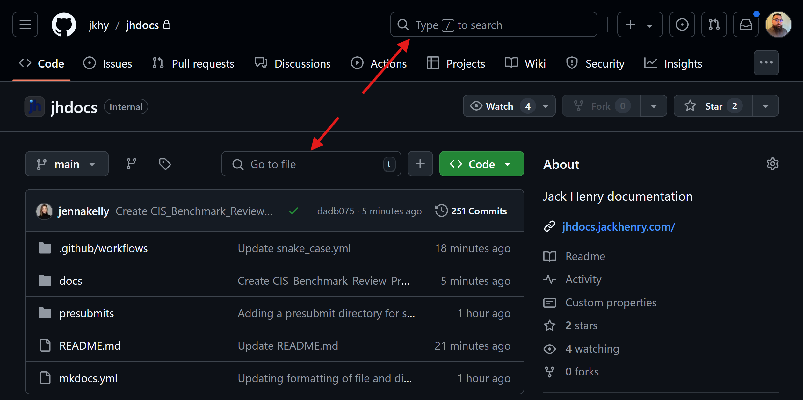
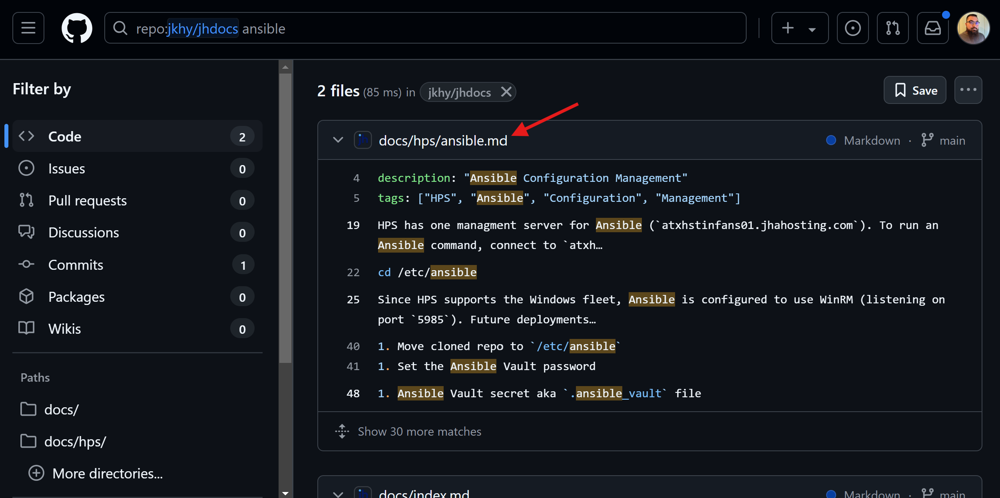
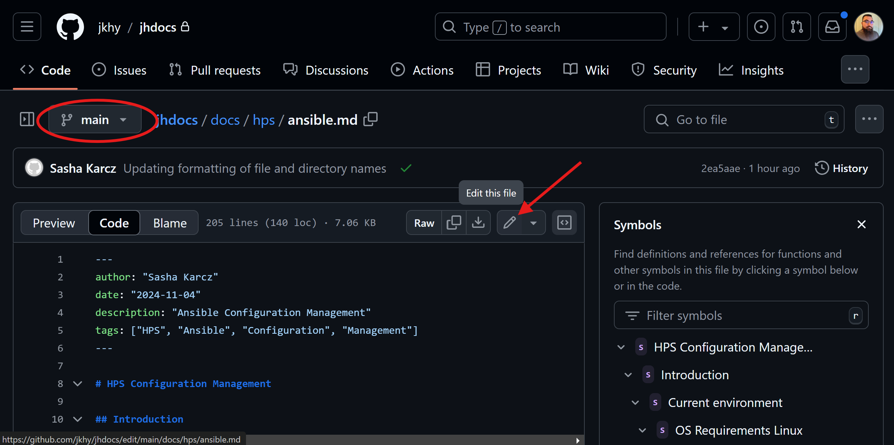
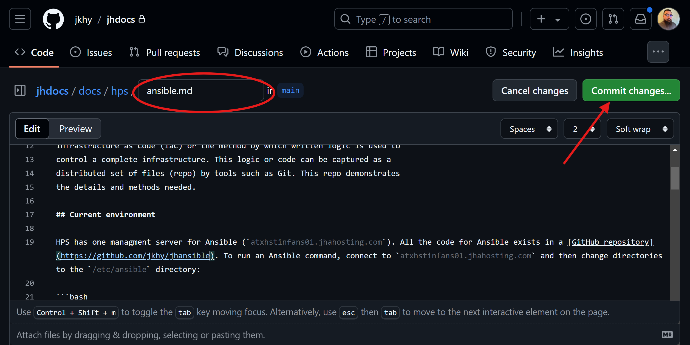
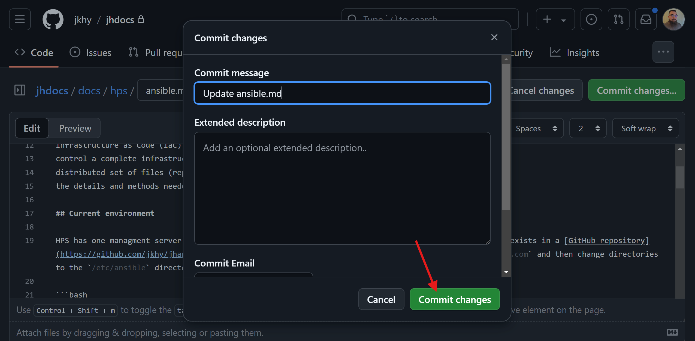
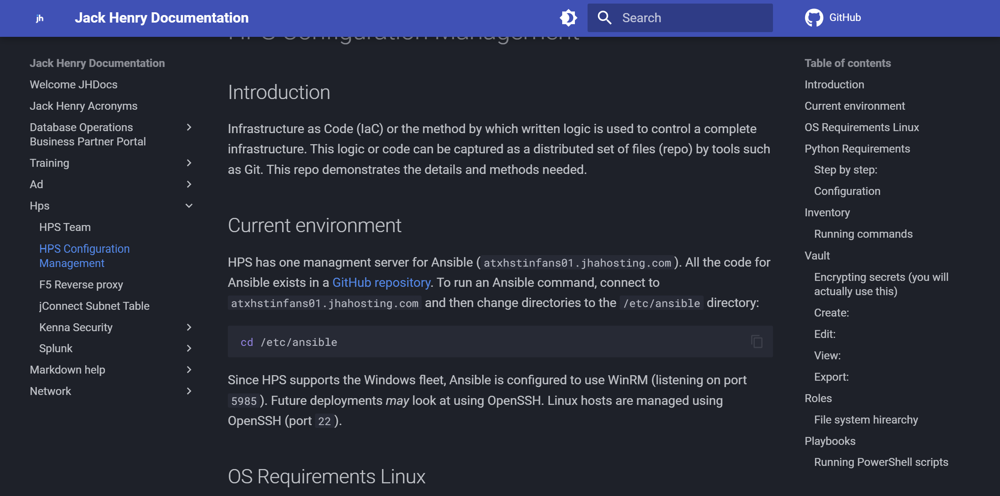

## Introduction

This is a step-by-step how to create changes or add new documents to `revelio`

## Procedures

### Step 1: Create a Change

1. Open the [GitHub Repo](https://github.com/jkhy/revelio) in a new tab.
2. Search for the document you want to edit.
    - Each document in [revelio](https://revelio.jackhenry.com) has an edit button at the top of the page.
    - Search via GitHub (see image).
    - Create new document in GitHub.
    
    
    /// caption
    Arrows point to the search boxes. Enter your query here, or press the `+` sign next to the `Go to file` box.
    ///

3. Choose the correct search result.

    
    /// caption
    Arrow points to the path of a file. Click on the path to open the file in the WebUI.
    ///

4. After selecting the file, click on the pencil icon to get into the editor. Ensure that you are on the **main** branch, see image.

    
    /// caption
    Arrow points to the pencil icon to get to the editor. The red circle in the upper left corner is where you can select what branch is currently selected. This branch should always be **main**.
    ///

5. Make changes. Here you can add content, or rename the file. See image.

    
    /// caption
    Arrow points to the `Commit changes` button. Click this when you are done. The red circle in the upper left corner is where you can rename the file. Ensure that the file has a `.md` at the end of it, otherwise it will not get rendered.
    ///

6. Commit Changes. After you click `Commit changes` another window will pop up. This will have a default `Commit message`. Feel free to change this if you'd like, or keep it as is. You are welcome to add an `Extended description`, but this is not necessary.

    
    /// caption
    Click (yet again) on the `Commit changes` button. This will be the last time you will need to click it, I promise.
    ///

### Step 2: Validate that change

1. Visit the [documentation page](https://revelio.jackhenry.com){:target="\_blank"} and navigate to your page. Ensure that your change is now live.
  - Updates should be rendered within 5-minutes.

    
    /// caption
    Validate that your change is live. It may take several refreshes, and possible holding `ctrl` and clicking refresh before your change is live. If there is an issue, start [troubleshooting](./Troubleshooting.md).
    ///

## Video

Here are the above steps in a video!

<figure class="video_container">
  <video controls="true" allowfullscreen="true">
    <source src="../videos/github_training.mp4" type="video/mp4">
  </video>
</figure>

## Additional Information

Provide any additional information, tips, or notes that are relevant to the document.

## Conclusion

Summarize the key points of the document. Provide any final thoughts or recommendations.
