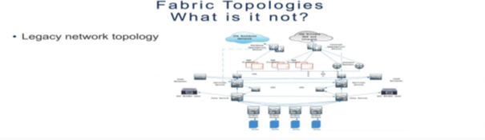
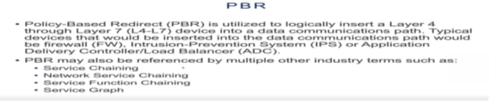

## Introduction

This document provides a high-level overview of ACI architecture and its traffic flow for Layer4-Layer7. It aims to give a basic understanding of ACI and its components.

## Procedures

### Basic Understanding of ACI

1. **Software-Defined Networking**: 
   Software-defined networking is an approach to network management that enables dynamic and programmatically efficient network configuration to improve network performance and monitoring in a manner more akin to cloud computing than to traditional network management.
2. **Intent-Based Networking**: 
   Intent-based networking is an approach to network management that enables dynamic and programmatically efficient network configuration to improve network performance and monitoring in a manner more akin to cloud computing than to traditional network management.
3. **Object-Oriented Networking**: 
   An Object-Oriented Network is a network (i.e., Bayesian network or Limid model) that in addition to the usual nodes, contains instance nodes. An instance node is a node representing an instance of another network. In other words, an instance node represents a subnet.

   

   
   
5. **Datacenter wide L3/L2 switch “one big switch”**: 
   ACI consists of three key components: The Application Policy Infrastructure Controller (APIC), the leaf switches, and the spine switches. The APIC is a centralized controller that manages all aspects of the ACI fabric.
6. **Shared Infrastructure**: 
   A Shared Infrastructure System is defined as a system that pools IT infrastructure provided by the service provider (e.g., hardware, operating system software, associated operating processes and tools) that can be physically used by several users at the time, thus being "shared".
7. **Meet point between legacy network stacks (VLAN tag translation)**: 
   It is especially important to understand the different VLAN types that run behind the scenes. VLAN in Cisco ACI is just an identifier to classify endpoints to each EPG. Bridge domain is the layer 2 domain instead of VLAN.
8. **Backbone aggregation**: 
   Spine switches form the backbone of the ACI fabric. These high-performance switches provide connectivity between leaf switches and facilitate east-west traffic within the fabric. Spine switches operate at Layer 3 and use routing protocols to distribute traffic across the fabric efficiently.
9. **Internet aggregation**: 
   WAN Aggregation is the practice of bundling – or aggregating – two or more ethernet links together into a single logical connection between two devices, with traffic spread evenly across these links then to another external network.
10. **Transit routing**: 
   Transit Routing in Cisco ACI enables the ACI fabric to function as a transit network, facilitating communication between external networks connected through different L3Out connections. With transit routing, traffic can flow from one external network, through the ACI fabric, and then to another external network.
11. **Service-chaining/Policy Based Redirection**: 
    With PBR, the Cisco ACI fabric can redirect traffic between security zones to L4-L7 devices, such as firewall, Intrusion-Prevention System (IPS), or load balancer, without the need for the L4-L7 device to be the default gateway for the servers or the need to perform traditional networking configuration such as ...
 **Nexus Switch Models to use**:
    - Nexus in ACI Mode
        - 9364C (Spine)
        - 9504 (Spine)
        - 9396PX (Leaf) (Gen1)
        - 9336C-FX2 (Leaf)
        - 93180YC-FX (Leaf)
        - 93180YC-EX (Leaf)
        - 93108TC-FX (Leaf)
        - 93108TC-EX (Leaf)
        - 93128TX (Leaf) (Gen1)
    - Nexus in NXOS Mode
        - 9364C (IPN)
        - 7706 (GOLF)

### Connectivity Structure

## ACI Architecture Overview

**Basic Topology**:
   - Cisco's ACI is built as a two-layer leaf-spine network topology. Leaf switches connect to servers and storage, while spine switches mesh the leaf switches together into a greater fabric. With this setup, admins can minimize latency and data processing bottlenecks.
      
   

**JHA Topologies**:
   - An ACI fabric forms a Clos-based spine-and-leaf topology and is usually depicted using two rows of switches. Depending on the oversubscription and overall network throughput requirements, the number of spines and leaf switches will be different in each ACI fabric.
     
   

**Initial Deployment**:
   - An ACI fabric forms a Clos-based Spine-and-Leaf topology and is depicted using two rows of switches. Depending on the oversubscription and overall network throughput requirements, the number of spines and leaf switches will be different in each ACI fabric.
   - ACI Fabric Access Policies are used to configure parameters that relate to access into the fabric (i.e., configuring ports on leaf switches for servers, firewalls, network switches, and other devices
   - ECMP: What ECMP is and how it works in Cisco ACI. ECMP (equal cost multipath) is a method to utilize multiple same-cost paths to route a packet to a destination. With ECMP, you can have more than one IP route installed in a routing table and have the capability to hash or load balance traffic flows through these routes.

   

## Terms to Know

   
   
### Fabric Constructs

An ACI fabric forms a Clos-based spine-and-leaf topology and is depicted using two rows of switches. Depending on the oversubscription and overall network throughput requirements, the number of spines and leaf switches will be different in each ACI fabric.

   

### Connectivity Structure

JHA Backbone Network connected to Backbone Aggregation Switch and JHA Private WAN and Internet connected to Internet Aggregation Switch. These two are logically connected to Services Switches. App Firewalls are connected to Backbone and Internet Aggregation Switch. J connect routers connect JHA Private WAN Routers. J connect Routers and App Firewall connect IPS on both sides. Load Balancer has two links connected to IPS and Services Switch. Services switches are connected to Core layer Switches in between IPS. Both sides are connecting ACI Border Leaf. For the end point, connected to access switch to Servers.

### Border Leaf

Border leaf switches provide Layer 2 and 3 connectivity between an ACI fabric and the outside world. Border leaf switches are sometimes points of policy enforcement between internal and external endpoints.

   
   
### Legacy Data Centers

Legacy data centers are older facilities that serve individual departments or a cluster of departments. This dataset contains data on Legacy data centers and includes metrics such as the cumulative number of data centers closed, the number of data centers planned for closure, and the square footage of the data centers.

   

### Traffic Flow

   

   

   

   

   

### Fabric Access Policy

Fabric policies represent how members come to agreement on accepting or rejecting changes to the network, a channel, or a smart contract. Policies are agreed to by the channel members when the channel is originally configured, but they can also be modified as the channel evolves. ACI Fabric Access Policies are used to configure parameters that relate to access into the fabric (i.e., configuring ports on leaf switches for servers, firewalls, network switches, and other devices).

### Domain

The physical domain in ACI defines a pool of resources that ACI can leverage to communicate to an external physical domain. Customers can leverage this method to connect Layer 2 (VLAN) to an external switch. This way they can migrate their workloads from existing networks into the ACI fabric.

### VLAN Pool

VLAN Pools, Domains, and AAEP are used. A VLAN Pool is used to define a range of VLANs that are allowed to be deployed on ACI fabric. With ACI, the pool created can be extended on physical interface.

### AAEP

Access Entity Profile (AAEP): The AAEP is a way of grouping together multiple domains that may need to be associated with an interface. In this example, a physical domain will be used when creating this AAEP.

### Interface Policy Group

A policy group is a grouping of policies (LLDP, CDP, SPEED) that will be used to configure a switch interface or interfaces. Enter a name for your Access Port Policy Group.

### Access Port Selector

Fabric ports are the links between leaf and spine nodes. Links between tier-1 and tier-2 leaf nodes in multi-tier topologies and links between remote leaf nodes (back-to-back links) are also considered to be fabric links.

### Interface Profile

Ties an Interface Policy Group to a specific interface number.

### Leaf Profile

Leaf profile manages profiles in a leaf workspace. The workspace must exist before the leaf profile command can be used (see leaf setup).

### Virtual Port Channel

A virtual port channel (vPC) allows links that are physically connected to two different ACI leaf nodes to appear as a single port channel to a third device (i.e., network switch, server, any other networking device that supports link aggregation technology).

### Tenant Constructs

#### VRFs

VRF is used to provide multi-tenancy functionality, for example, where each tenant has its own unique routing tables and requires different default gateways. Processes can bind a socket to the VRF device. Packets through the binded socket use the routing table associated with the VRF device.

#### Bridge Domains

A bridge domain is simply a layer 2 forwarding construct within the fabric, used to define a flood domain. You're probably now thinking “that's just like a VLAN” - and you'd be right, except that bridge domains are not subject to many of the same limitations as VLANs, such as the 4096-segment limit.

#### End Point Groups

EPGs are a grouping of end-points representing application or application components independent of other network constructs.

#### L3 Outs

The Layer 3 Out (L3Out) in Cisco Application Centric Infrastructure (Cisco ACI) is the set of configurations that define connectivity to outside of ACI via routing. The goal of this document is to explain thoroughly Cisco ACI design concepts and options related to the ACI L3Out.

#### Contracts

A written contract between a landlord and a tenant to lease an identified property for a specified term at an agreed rate, and the rights and duties of both parties during and after the lease period.

#### L4-L7 Service Graph

ACI Service Graph is a method through which a Layer 4 to Layer 7 function or device can be integrated in ACI. This helps ACI to re-direct the traffic between different security zones of FW or load balancer.

### Supporting Policies

The ACI policy model is an object-oriented model based on promise theory. Promise theory is based on scalable control of intelligent objects rather than more traditional imperative models, which can be thought of as a top-down management system.

### Switch Virtual Interface (SVI)

Represents a logical layer-3 interface on a switch. VLANs divide broadcast domains in a LAN environment. Whenever hosts in one VLAN need to communicate with hosts in another VLAN, the traffic must be routed between them. This is known as inter-VLAN routing. VLAN interface is a virtual routed interface that connects a VLAN on the device to the Layer 3 router engine on the same device.

### Router Relationship between EPG

Shared L3 Out connection, you can define the connection as usual in the shared tenant (this tenant can be any tenant, not necessarily the common tenant). The external network should be defined as usual. However, it should be marked with Shared Route Control Subnet and Shared Security Import Subnet. This means that the routing information from this L3 Out connection can be leaked to other tenants, and subnets accessible through this L3 Out connection will be treated as external EPGs for the other tenants sharing the connection.

### Classic Three Architecture

(Application Centric Infrastructure) is a data centre network architecture that provides more flexible and efficient application deployment and management. Both physical and virtual networks can be controlled by one point of control which allows greater transparency for easy management of complex networks.

### BD for L3 Out

A Bridge Domain (BD) is a Layer 2 representation inside the ACI fabric. The BD is where users will define their Anycast Gateway/subnet which would provide the default gateway for their host attached to the fabric. EPGs are associated to a single bridge domain (BD) and used to define security zones within a BD.

### External EPG

L3Out (Layer 3 Out) A Layer 3 external outside network (l3extOut object) includes the routing protocol options (BGP, OSPF, EIGRP, static) and the switch-specific and interface-specific configurations. The External EPG exposes the external network to tenant EPGs through a contract.

### Policy Based Redirect

Cisco Application Centric Infrastructure (ACI) policy-based redirect (PBR) enables provisioning service appliances, such as firewalls or load balancers, as managed or unmanaged nodes without needing a Layer 4 to Layer 7 package.

### L3 VXLAN

Virtual Extensible LAN (VXLAN) is a network virtualization technology that attempts to address the scalability problems associated with large cloud computing deployments. VXLAN is sometimes considered a Layer 3 protocol because it relies on an IP (Layer 3) transport network. It is considered a Layer 4 standard because it encapsulates Ethernet frames in UDP, affecting Layer 4 UDP by operation.

### Service Chaining

With PBR, the Cisco ACI fabric can redirect traffic between security zones to L4-L7 devices, such as a firewall, Intrusion-Prevention System (IPS), or load balancer, without the need for the L4-L7 device to be the default gateway for the servers or the need to perform traditional networking configuration such as ...

### Network Service Chaining

Network service chaining, also known as service function chaining (SFC), is a capability that uses software-defined networking (SDN) capabilities to create a chain of connected network services, such as L4-7 services like firewalls, network address translation (NAT), and intrusion protection.

### Service Function Chaining

Service Function Chaining is a mechanism for overriding the basic destination-based forwarding that is typical of IP networks. It is conceptually related to Policy Based Routing in physical networks, but it is typically thought of as a Software Defined Networking technology.

### Service Graph

ACI Service Graph is a method through which a Layer 4 to Layer 7 function or device can be integrated in ACI. This helps ACI to re-direct the traffic between different security zones of FW or load balancer.

### Policy Model for Tac Engineer Troubleshooting

#### PALO ALTO Firewall

The DMZ Server within my topology is a Cisco router that will act as a web server to accept HTTP, HTTPS, and SSH requests. This DMZ server has a default route configured to route out to the DMZ interface of the firewall, port e1/2 at IP address 172.16.

#### Cisco ASA Firewall

Servers and resources in the DMZ are accessible from the internet, but the rest of the internal LAN remains unreachable. This approach provides an additional layer of security to the LAN as it restricts a hacker's ability to directly access internal servers and data from the internet.

#### EPG-FE-DMZ

L2Out can be useful when you want to segregate inside the BD, but then you need to manage different EPGs for FW, manage an additional Vlan Pool, apply contracts to allow servers to reach their gateway... It changes your legacy security concept and adds a lot of operational constraints.

### Fabric and Tenant Relationship

The Cisco ACI fabric uses LLDP- and DHCP-based fabric discovery to automatically discover the fabric switch nodes, assign the infrastructure VXLAN tunnel endpoint (VTEP) addresses, and install the firmware on the switches. Unlike the Fabric Policies which are often configured at turn up and then largely left alone, Access Policies are used often to configure new vlans, domains, switches, and interfaces. Fabric Policies are analogous to configuring two switches in VSS mode or in a vPC domain or VDC.

Note: There are three pre-existing Tenants available by default in ACI. They are common, infra, and mgmt. Common: This Tenant contains pre-defined policies that are very much used in all other Tenants, such as LB, Firewalls, Layer4-layer 7 Services etc.

## Outcome of Multi Path

 It provides a centralized management platform that simplifies network policy configuration and enforcement, reducing the risk of errors and inconsistencies. One of the key benefits of Cisco ACI Multi-Site is its ability to automate network provisioning and configuration.

## Conclusion

In conclusion, understanding the ACI architecture and its traffic flow for Layer4-Layer7 is crucial for efficient network management. ACI provides a robust framework with its software-defined networking, intent-based networking, and object-oriented networking approaches. The architecture's key components, such as the APIC, leaf switches, and spine switches, work together to create a highly scalable and efficient network environment. The integration of shared infrastructure, backbone aggregation, and service-chaining further enhances the network's capabilities. By leveraging ACI's features, organizations can achieve centralized management, automated network provisioning, and improved performance. This document has provided a comprehensive overview of ACI, its components, and the benefits it offers for modern network infrastructures.
