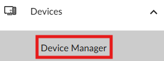
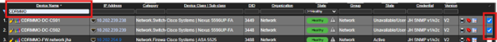
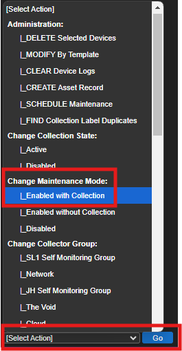
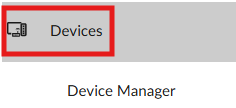
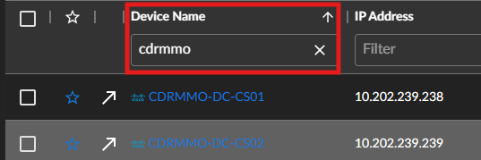
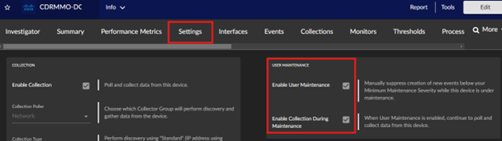
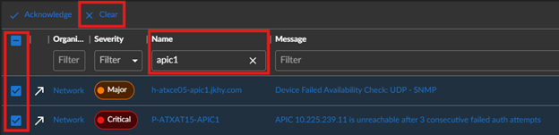

## Introduction

This document provides a temporary process for disabling monitoring for decommissioned devices via Architect Access. This process is pending company compliance decisions on data archiving and purging.

## Procedures

### Step 1: Log into SL1 and Navigate to Device Manager

1. **Log into [SL1](https://jackhenry.sciencelogic.net/events)**: Use your credentials to log into the SL1 system.
2. **Navigate to [Device Manager](https://jackhenry.sciencelogic.net/inventory/devices)**: Go to Devices -> Device Manager.

 

### Step 2: Search for the Decommissioned Device

1. **Search for the device**: Enter the name or identifier of the decommissioned device in the search bar.

### Step 3: Select the Device(s)

1. **Select the device(s)**: Check the boxes on the far right side of the screen for the device(s) you want to disable monitoring for.

### Step 4: Change Maintenance Mode

1. **Open the “Select Option” dropdown**: Located at the bottom right corner of the screen.
2. **Select Change Maintenance Mode**: Choose "Enable with Collection".
3. **Click “Go”**: Apply the changes.
   

### Step 5: Verify Device Settings

1. **Navigate to the device**: Search for the device again.
   

2. **Open the device**: Click on the device to open its details.
3. **Move to the “Settings” tab**: Ensure User Maintenance has both options selected.

### Step 6: Clear Alerts

1. **Navigate to home for alerts**: Go to the alerts section.
2. **Search for the device**: Enter the device name or identifier.
3. **Check the box for alerts**: Select the box on the left of any alerts for the decommissioned device(s).
4. **Select Clear Alert**: Click "Clear Alert" at the top of the page.
5. **Confirm prompts**: Acknowledge any prompts to confirm the alerts are being cleared.

## Additional Information

This is a temporary process pending company compliance decisions on data archiving and purging. Once a decision is made, the manual process flow will be adjusted accordingly.

## Conclusion

This document outlines the steps to disable monitoring for decommissioned devices in SL1. Ensure to follow the steps carefully and confirm all prompts to complete the process.
