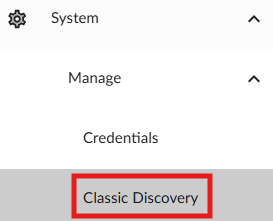

## Introduction

This document provides step-by-step procedures for manually adding devices to SL1 via Architect Access. It aims to help technicians efficiently add and verify devices in SL1.

## Procedures

### Step 1: Log into SL1

1. **Navigate to Classic Discovery**: Log into SL1 and navigate to System -> Manage -> Classic Discovery.
 

### Step 2: Locate Discovery Session

1. **Find Session**: Locate the session named “Nikki’s Updates” and double-click to open the discovery session.
    - Note: The order in the list updates as changes are made and jobs are used.
 

### Step 3: Update IP Information

1. **Update IP**: Update the IP information and click “Save”.
2. **Verify Update**: Ensure the update saved by checking the last edit date/time.
 
 

### Step 4: Run Discovery Job

1. **Start Job**: Click the lightning bolt on the right side of the job to run the job.
    - If you need to stop the job, click the bomb icon on the right side.
2. **Confirm Start**: A prompt will pop up to confirm you want to start a manual discovery job, click OK.
 

4. **Monitor Job**: A new window will pop up showing the job status and logs.
    - Each IP listed will return a response for success or failure.
    - Failures will need to be reviewed further.

### Step 5: Verify Device in Device List

1. **Check Device List**: Ensure the device shows up as expected.
    - If the device does not show up, it should correlate to a failure response on the job run window and will need to be reviewed further for SNMP communications/ACLs.
    - If configurations look right on the device, further review with the Observability team on the SL1 side will be needed.
    - Any mismatch (like incorrect device class, correct IP but incorrect name, etc.) will also need to be reviewed with Observability on the SL1 side.
 
 

## Conclusion

By following these procedures, technicians can manually add devices to SL1 via Architect Access and ensure they are correctly configured and verified.
