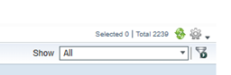

## Introduction

This document provides a step-by-step guide on how to add new devices into the ISE server for TACACS. Ensure you are connected to the ra.jhavpn.com VPN before accessing the ISE server.

## Procedures

### Step 1: Access the ISE Server

- Connect to the ra.jhavpn.com VPN.
 
   

 - Open a web browser and navigate to the primary ISE server: [https://bmomnise01.jkhy.com/admin/login.jsp](https://bmomnise01.jkhy.com/admin/login.jsp).
 - Click on the underlined sentence at the bottom left-hand side of the page: "Proceed to bmomnise01.jhky.com (unsafe)"
 
  

 - Enter your credentials. Ensure the identity source is set to AD1.

 

### Step 2: Navigate to Network Devices
 - On the Home Page, click on the **Administration Tab** (4th Tab).
 - Choose **Network Devices** from the right side of the drop-down menu.
   
 
 
 - You should now see a list of all the devices in the network.

 

### Step 3: Duplicate an Existing Device

 - Use the filter button (looks like a funnel) to find a similar named device to duplicate.

 

 - Click on the device to review its settings and ensure they match what you want to duplicate.

 

### Step 4: Update the Device Information

- Update the copied device with the new device's information:
    - **Name**
    - **Description**
    - **IP Address**
    - **Location**
    - **IPSEC**
    - **Device Type**
    - **Division**
    - **Business Units**

 

 - Ensure the **TACACS** box is checked and that the **Shared Secret** is copied over. If not, add it manually.

 

### Step 5: Verify the Device Addition

 - Check to see if your device was added to the list of **Network Devices**.
 - Attempt to log into the device using Secure CRT from one of the jumping boxes to ensure TACACS is working. Note that TACACS must be configured on the device first.

### Step 6: Log Out

 - Once finished, log out by clicking on the cog wheel on the far-right top-hand corner.

 

## Additional Information

Ensure that all device information is accurate and that TACACS is properly configured on the device before attempting to log in.

## Conclusion

This document provided a step-by-step guide to adding new devices into the ISE server for TACACS. Ensure all steps are followed carefully to avoid any configuration issues.
