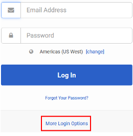

# Transferring the On Call Phone

## Procedures

1. Log into [Genesys Cloud](https://apps.usw2.pure.cloud)

2. First time users must complete the following steps:
    - Select "More Login Options"
    - Enter `jackhenry` as the organization name
    - Click 'Next' to return to the login prompt

      

      

3. Log into the correct account.
    - Check vault for user and password.

4. Select the Profile option from the left navigation menu

5. Select "Forward my Calls"

6. Ensure the "Forward Calls" option is toggled on

7. Enter your contact number into the "find me at the following numbers" box

8. Click the X at the top right of this pop out box

9. Select "Logout" at the bottom of the profile pop out box
