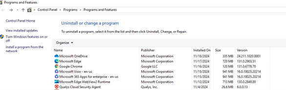
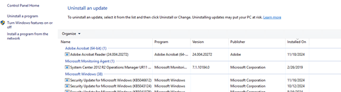

## Introduction

This document outlines the process to follow for setting up and maintaining the automatic patching schedule for jumpboxes.

## Procedures

### Step 1: Verify Jumpboxes on Automatic Patching Schedule

We have verified that these seven jumpboxes are on the automatic patching schedule

  - pemmonetapp.jkhy.com (RDP Access)
  - peatx3netapp.jkhy.com (RDP Access)
  - peatx3network.jkhy.com (RDP Access)
  - moconetappp03.jhacorp.com (corp server) (RDP Access)
  - smonetworkapp.jhacorp.com (corp server) (RDP Access)
  - mmoconetapp04.jhacorp.com (corp server) (RDP Access)
  - mmonetworkapp.jhacorp.com (corp server) (RDP Access)

If any new jumpboxes are added in the future, we will need to submit a ticket to be added to the patching schedule in jhNow (see in a different section how to submit a ticket in jhNow).

### Step 2: Attend Patching Monthly Review Meeting

Attend the Patching Monthly Review meeting on the 2nd Friday of each month. There will be a “Patching Community” Sync-Up provided in the meeting invite email. This document includes important information regarding the monthly updates that will occur and the CVEs that they will address. We will use this to check that all updates were installed on Patch Monday.

### Step 3: Automatic Updates Installation

Automatic updates will be installed on our jumpboxes 4 days after Patch Tuesday (occurs on the 2nd Tuesday of each month).

### Step 4: Verify Security Updates Installation

Verify that the security updates have been installed successfully on all seven jumpboxes on the afternoon of Patch Monday (3rd Monday of each month).

There are two places to verify that the updates were installed successfully:
1. Log into each of the seven jumpboxes and search for “Programs and Features” using the search at the bottom of the page. Or you can also search for this in the "Control Panel”. There will be a list of installed programs. Use the “installed on” column to sort by so that the most recently installed updates are at the top.

2. Additionally, choose “view installed updates” to verify the security updates were installed.

Verify that the updates were installed by looking at the output and comparing it to the list provided at the “Patching Community” Sync-Up. If all updates were installed successfully, notate the jumpbox and that all updates were installed successfully for that month.

If they were not installed, a ticket will need to be submitted in jhNow to get them installed (please see submitting a jhNow ticket to be added to the “Automatic Patching Schedule”).

## Additional Information

Add link here for "Submitting a jhNow ticket"

## Conclusion

The need for this policy is to ensure that all jumpboxes and servers are consistently updated to protect against vulnerabilities. The TS department is responsible for the implementation and management of the patching process.
