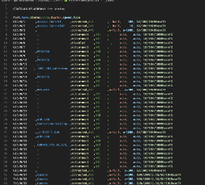

# Show Interface in Excel

## The Reason

This outlines how to use Excel to populate interface information from a network device. This is useful for quickly gathering and analyzing data from multiple devices.

## The Steps

1. **Logon to the device**
   - Use SecureCRT to logon to the device.
2. **Run the command**
    - Use the command `show interface` to gather the information you need.
3. **Copy the output**
    - Highlight the output in SecureCRT and copy it to your clipboard.
4. **Copy the output to VSCode**
    - Open VSCode and paste the output into a new file.

      

5. **Format the output**
    - Convert the output to CSV format:
      1. Collapse the headers and each section of the output.
      2. Use the "Change All Occurrences" feature in VSCode to expedite the changes.
    - For better readability, use the [Rainbow CSV](https://marketplace.visualstudio.com/items?itemName=mechatroner.rainbow-csv) extension in VSCode to highlight the CSV structure with colors.

      

6. **Open in Excel**
    - Open Excel and save as an Excel Workbook, `xlsx`.

      

7. **Create a Table**
    - Create a table in Excel to make the data more manageable and visually appealing.

      

    - Note: "*My table has headers*" should be checked to ensure the first row is treated as headers.

    - The final output should look like this:

      

## Usage

- This method is useful for quickly gathering and analyzing interface information from multiple devices.

### Interface Connected Count

Now to create a count, in an open field use the Below setup:

#### Counting Connected and Not Connected Ports in an Excel Table

