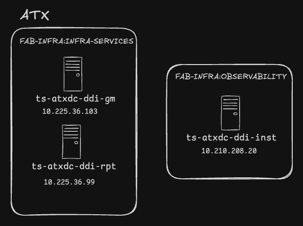
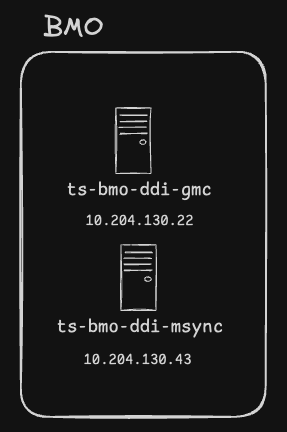

# Infoblox High Level Diagrams

## ATXDC

| Hostname | IP Address | Description |
| --- | --- | --- |
| ts-atxdc-ddi-gm | 10.225.36.103 | Grid Master VIP |
| ts-atxdc-ddi-rpt | 10.225.36.99 | Reporting Node |
| ts-atxdc-ddi-inst | 10.210.208.20 | Network Insights/Discovery |

The GM is comprised of two nodes in a HA pair.

| Hostname | IP Address |
| --- | --- |
| node1 | 10.225.36.97 |
| node2 | 10.225.36.98 |

## BMO

| Hostname | IP Address | Description |
| --- | --- | --- |
| ts-bmo-ddi-gmc | 10.204.130.22 | Grid Master Candidate |
| ts-bmo-ddi-msync | 10.204.130.43 | Microsoft Sync Node|